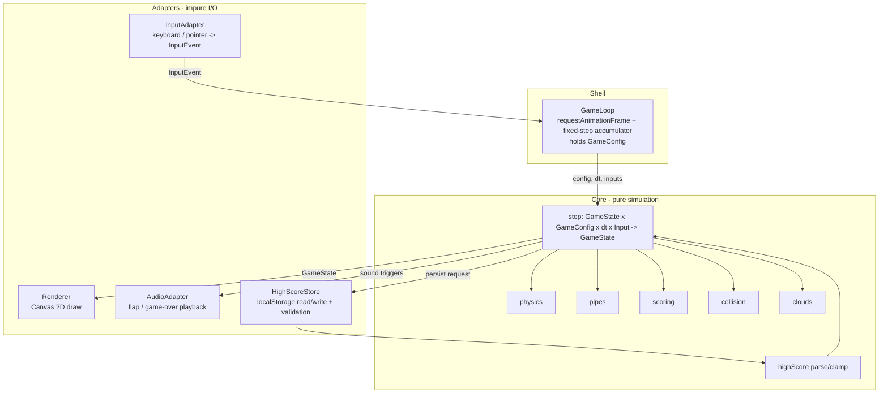

# Design Document

## Overview

Flappy Kiro is a single-page, browser-based endless scroller. The player keeps a ghost sprite aloft by flapping, threading it through scrolling pipe gaps while gravity constantly pulls it down. The game tracks the current score, persists a high score in browser local storage, and ends on collision or boundary breach.

The central design decision is a strict separation between **pure simulation logic** and **impure I/O** (canvas rendering, audio playback, local storage, input events, animation timing). The simulation is modeled as a deterministic state-transition function parameterized by a centralized configuration object:

```
update(state, config, dt, inputs) -> nextState
```

This shape makes the bulk of the game's behavior — physics, pipe generation, scoring, collision, state transitions, high-score logic — testable as pure functions over generated inputs. Rendering and audio are thin consumers of the resulting state and carry no game logic of their own.

Every tunable value the simulation uses (physics constants, field-relative ratios, cloud parameters) is collected into a single `GameConfig` object that is threaded explicitly through the pure core as a parameter. No tunable number is hardcoded inside a function body; the simulation reads everything it needs from the config it is handed. This makes the whole game retunable from one place and lets property tests vary the configuration itself. The simulation contract therefore becomes:

```
step(state, config, dt, input) -> nextState
```

### Technology Choices

- **Language: TypeScript.** Static typing keeps the state model and the simulation contract explicit, which matters for a system with several interacting numeric invariants (velocities, boundaries, gaps). It compiles to plain JavaScript and runs in any modern browser.
- **Rendering: HTML5 Canvas 2D.** The reference UI (`img/example-ui.png`) is a flat 2D scene (sky-blue field, clouds, green pipes, a ghost sprite, score text). Canvas 2D is the simplest fit and gives precise control over the per-frame draw needed for a 60 FPS loop. No game engine or framework is required.
- **Build/dev tooling: Vite.** Fast dev server and zero-config TypeScript bundling for a browser target.
- **Testing: Vitest + fast-check.** Vitest runs in a Node/jsdom environment and integrates cleanly with Vite. fast-check is a mature property-based testing library for the TypeScript/JavaScript ecosystem and is used to validate the correctness properties below. We do not implement property testing from scratch.

These are conventional, well-supported choices for a small browser game; no external runtime dependencies are needed beyond the dev toolchain.

### Key Design Decisions

1. **Fixed-timestep simulation with an accumulator.** The render loop is driven by `requestAnimationFrame`, but the simulation advances in fixed steps (`dt = config.physics.fixedTimestep = 1/60 s`). This decouples game behavior from real frame timing, so physics constants (gravity, flap, terminal velocity — all read from `config`) behave identically regardless of the actual display refresh rate, and the simulation stays deterministic and reproducible for property tests. (Requirements 3.1–3.5, 8.8)
2. **Logical coordinate space.** All gameplay math uses a logical `Play_Field` of width `W` and height `H`; positions that the requirements express as percentages (ghost at `startXRatio`/`startYRatio`, gap size `gapHeightRatio`, boundary `marginRatio`, scroll speed = `W / scrollSeconds`) are computed from `W`/`H` and the corresponding `config` ratios. The canvas is scaled to the logical field on resize. This keeps the simulation resolution-independent and lets property tests generate arbitrary field dimensions.
3. **Y axis points down.** Canvas convention: `y = 0` is the top boundary, `y = H` is the bottom boundary. "Upward" velocity (flap) is therefore negative, and gravity is positive. The requirements' "upward 500 px/s" maps to `config.physics.flapVelocity = -500`; "downward terminal 900 px/s" maps to `vy <= config.physics.terminalVelocity`.
4. **State machine over three modes.** `Ready`, `Playing`, `Game_Over`. Each `update` and input is interpreted relative to the current mode, which keeps transition rules explicit and isolated.
5. **Centralized, threaded `GameConfig`.** Every tunable value lives in a single `GameConfig` object with a `DEFAULT_CONFIG` constant that is the single source of truth for the numbers in the derived-constants table. `GameConfig` is passed as an explicit parameter into `step` and the pure helpers that need it, rather than being stored inside `GameState`. *Rejected alternative:* embedding the config inside `GameState`. That would bloat every state value, force every `GameState` generator in the property tests to also carry a config, and blur the line between "the changing world" (state) and "the fixed rules of this run" (config). Keeping config as a separate threaded parameter keeps `GameState` lean, keeps the PBT generators for state and config independent and composable, and makes it explicit that config does not change across a step.

## Architecture

The system is organized in three layers. The **core** layer is pure and holds all game rules. The **adapter** layer wraps browser APIs behind narrow interfaces. The **shell** wires them together and owns the loop.



### Control flow per frame

1. `GameLoop` receives the elapsed wall-clock time from `requestAnimationFrame` and adds it to an accumulator. The loop holds the `GameConfig` for the run (built from `DEFAULT_CONFIG`) and uses `config.physics.fixedTimestep` as its step size.
2. While the accumulator holds at least one fixed step (`config.physics.fixedTimestep`), it calls the pure `step(state, config, dt, input)` once per step, draining queued input events. This yields the next `GameState` and a list of **effects** (sounds to play, high score to persist).
3. The shell dispatches effects to the adapters (`AudioAdapter`, `HighScoreStore`).
4. `Renderer` draws the final `GameState` for the frame.

Effects are returned as data from the pure core rather than performed inside it. This keeps `step` pure and makes "plays the flap sound", "plays game-over sound exactly once", and "persists the high score" assertable in tests by inspecting the returned effects, without real audio or storage.

## Components and Interfaces

### Core (pure)

```typescript
// Discrete simulation step. The single source of truth for game rules.
// `config` carries every tunable value and is threaded in, never stored in state.
function step(state: GameState, config: GameConfig, dt: number, input: InputEvent | null): StepResult;

interface StepResult {
  state: GameState;
  effects: Effect[]; // sounds to play, persistence requests
}

type Effect =
  | { kind: "playFlapSound" }
  | { kind: "playGameOverSound" }
  | { kind: "persistHighScore"; value: number };

// Physics (pure helpers used by step)
function applyGravity(vy: number, config: GameConfig, dt: number): number; // clamp to terminal velocity
function applyFlap(config: GameConfig): number;                            // returns config.physics.flapVelocity
function integratePosition(y: number, vy: number, dt: number): number;

// Pipes
function scrollPipes(pipes: PipePair[], config: GameConfig, dt: number, field: Field): PipePair[];
function shouldSpawn(pipes: PipePair[], config: GameConfig, field: Field): boolean;
function spawnPipe(rng: Rng, config: GameConfig, field: Field): PipePair;
function cullPipes(pipes: PipePair[], field: Field): PipePair[];

// Scoring
function applyScoring(state: GameState): { score: number; pipes: PipePair[]; scored: boolean };

// Collision
function ghostCollides(ghost: Ghost, pipes: PipePair[], field: Field): boolean;
function ghostOutOfBounds(ghost: Ghost, field: Field): boolean;

// Clouds (decorative; never affects gameplay)
function scrollClouds(clouds: Cloud[], dt: number, field: Field): Cloud[];
function makeClouds(rng: Rng, config: GameConfig, field: Field, pipeSpeed: number): Cloud[];

// State reset (Ready). Uses config for the canonical start position.
function toReady(state: GameState, config: GameConfig, field: Field): GameState;

// High score
function parseHighScore(raw: string | null): number; // valid non-negative int, else 0
```

### Adapters (impure)

```typescript
interface HighScoreStore {
  load(): number;                 // delegates to parseHighScore over localStorage value
  save(value: number): boolean;   // returns false if persistence fails (e.g. quota/denied)
}

interface AudioAdapter {
  play(sound: "flap" | "gameOver"): void; // tolerant of load/playback failure
}

interface Renderer {
  render(state: GameState): void; // draws field, clouds, pipes, ghost, score/high-score text
}

interface InputAdapter {
  // Emits a normalized InputEvent for keydown and pointerdown within the Play_Field.
  poll(): InputEvent[];
}

type InputEvent =
  | { type: "flap" }     // Space / ArrowUp / pointer click during Ready or Playing
  | { type: "restart" }; // any key / click during Game_Over
```

Note: a single physical action (key press / click) is interpreted by `step` according to the current `Game_State`: it acts as a flap in `Ready`/`Playing` and as a restart in `Game_Over`.

### Shell

```typescript
class GameLoop {
  // `config` defaults to DEFAULT_CONFIG; the loop holds it and passes it into every step.
  constructor(
    adapters: { input; renderer; audio; store },
    config: GameConfig = DEFAULT_CONFIG,
  ) {}
  start(): void; // schedules requestAnimationFrame, owns accumulator and effect dispatch
}
```

## Data Models

```typescript
type GamePhase = "Ready" | "Playing" | "GameOver";

interface Field {
  width: number;   // logical W, > 0
  height: number;  // logical H, > 0
}

interface Ghost {
  x: number;       // fixed at config.ghost.startXRatio * W during play
  y: number;       // vertical center of rendered bounds
  vy: number;      // vertical velocity, px/s; negative = upward
  width: number;   // rendered bounds
  height: number;
}

interface PipePair {
  x: number;          // left edge of the pair, scrolls from W toward 0
  width: number;      // horizontal width of the pair
  gapCenterY: number; // vertical center of the gap
  gapHeight: number;  // config.pipes.gapHeightRatio * H (within tolerance at spawn)
  scored: boolean;    // true once it has incremented the score
}

interface Cloud {
  x: number;
  y: number;
  width: number;
  height: number;
  opacity: number;    // within config.clouds.opacityRange
  speed: number;      // px/s, config.clouds.speedRange * pipe scroll speed
}

interface GameState {
  phase: GamePhase;
  field: Field;
  ghost: Ghost;
  pipes: PipePair[];
  clouds: Cloud[];
  score: number;      // non-negative integer
  highScore: number;  // non-negative integer
  rng: Rng;           // seedable PRNG state for deterministic spawning/tests
  spriteLoaded: boolean; // false -> ghost drawn as placeholder shape
}
```

### Configuration

All tunable values are centralized in a single `GameConfig` object so the entire game can be retuned from one place and so property tests can vary the configuration itself. The config is split into two categories:

- **Absolute physics constants** — pixel/second values and the simulation timestep. These are independent of field size.
- **Field-relative ratios and parameters** — fractions of the logical field width `W` or height `H` (plus a few absolute sprite/pipe sizes and cloud counts/ranges). These are resolved against the actual `Field` at use sites, keeping the simulation resolution-independent.

```typescript
interface GameConfig {
  physics: {
    gravity: number;          // px/s^2, downward (+)
    flapVelocity: number;     // px/s, upward (negative)
    terminalVelocity: number; // px/s, max downward (+)
    fixedTimestep: number;    // seconds per simulation step
  };
  ghost: {
    startXRatio: number;      // fraction of W for the fixed horizontal position
    startYRatio: number;      // fraction of H for the Ready vertical position
    width: number;            // rendered bounds, px
    height: number;           // rendered bounds, px
  };
  pipes: {
    gapHeightRatio: number;   // fraction of H for the gap size
    marginRatio: number;      // fraction of H kept clear of each boundary
    scrollSeconds: number;    // seconds to traverse the full field width
    spawnGapRatio: number;    // fraction of W the newest pipe travels before spawning the next
    width: number;            // horizontal width of a pipe pair, px
  };
  clouds: {
    minCount: number;         // minimum clouds generated
    maxCount: number;         // maximum clouds generated
    opacityRange: [number, number]; // inclusive [min, max] opacity
    speedRange: [number, number];   // [min, max] as a fraction of pipe scroll speed
  };
}

// Single source of truth for the values in the Derived constants table.
const DEFAULT_CONFIG: GameConfig = {
  physics: {
    gravity: 1800,
    flapVelocity: -500,
    terminalVelocity: 900,
    fixedTimestep: 1 / 60,
  },
  ghost: {
    startXRatio: 0.30,
    startYRatio: 0.50,
    width: 48,   // sprite-sized rendered bounds; tune freely
    height: 48,
  },
  pipes: {
    gapHeightRatio: 0.25,
    marginRatio: 0.10,
    scrollSeconds: 4.0,
    spawnGapRatio: 0.50,
    width: 80,   // tune freely
  },
  clouds: {
    minCount: 2,
    maxCount: 6,
    opacityRange: [0.40, 0.70],
    speedRange: [0.10, 0.40],
  },
};
```

Derived quantities are computed from `config` and the current `Field`: pipe scroll speed = `W / config.pipes.scrollSeconds`; gap height = `config.pipes.gapHeightRatio * H`; the ghost's Ready position = `(config.ghost.startXRatio * W, config.ghost.startYRatio * H)`; the spawn trigger distance = `config.pipes.spawnGapRatio * W`; the gap-center bounds keep the gap at least `config.pipes.marginRatio * H` from each boundary.

The `ghost.width`/`ghost.height` and `pipes.width` defaults are starting sizes and may be tuned without affecting any correctness property, since every property is stated relative to `config` rather than to a fixed literal.

**Configuration mechanism.** The primary (and currently only) mechanism is the **build-time `DEFAULT_CONFIG`**: the shell constructs `GameLoop` with `DEFAULT_CONFIG`, so tuning the game means editing those values and rebuilding. Because `GameConfig` is already threaded as an explicit parameter, there is a clear seam for **optional runtime overrides** as a future option — e.g. reading a partial config from URL query params or a debug panel and deep-merging it over `DEFAULT_CONFIG` before passing it to `GameLoop`. This is intentionally out of scope for now; no runtime override source is wired up, but adding one requires no change to the pure core.

### Derived constants

These rows enumerate the **`DEFAULT_CONFIG`** values, which are the single source of truth for the simulation's tunable numbers. The Source column maps each value to the requirement it satisfies; every value is now read from `config` at runtime rather than hardcoded.

| Constant | `DEFAULT_CONFIG` path | Value | Source |
| --- | --- | --- | --- |
| Gravity | `physics.gravity` | `1800` px/s² | Req 3.1 |
| Flap velocity | `physics.flapVelocity` | `-500` px/s (upward) | Req 2.2, 3.2 |
| Terminal velocity | `physics.terminalVelocity` | `+900` px/s (downward) | Req 3.5 |
| Fixed timestep | `physics.fixedTimestep` | `1/60` s | Req 3.4, 8.8 |
| Ghost ready position | `ghost.startXRatio`, `ghost.startYRatio` | `x = 0.30 * W`, `y = 0.50 * H` | Req 1.2 |
| Pipe scroll speed | `pipes.scrollSeconds` | `W / 4.0` px/s | Req 4.1 |
| Spawn trigger | `pipes.spawnGapRatio` | newest pipe moved `0.50 * W` from right edge | Req 4.2 |
| Gap height | `pipes.gapHeightRatio` | `0.25 * H` | Req 4.5 |
| Gap margin | `pipes.marginRatio` | gap center within `[0.10*H + gapHeight/2, 0.90*H - gapHeight/2]` | Req 4.4 |
| Cloud count | `clouds.minCount`, `clouds.maxCount` | `2 .. 6` | Req 8.3 |
| Cloud opacity | `clouds.opacityRange` | `0.40 .. 0.70` | Req 8.4 |
| Cloud speed | `clouds.speedRange` | `0.10 .. 0.40 * pipeSpeed` | Req 8.5 |

### Rendered bounds and collision model

The ghost's rendered bounds are an axis-aligned rectangle centered on `(ghost.x, ghost.y)` with size `ghost.width × ghost.height`. A pipe pair occupies the rectangle `[x, x+width]` horizontally; its upper segment spans `[0, gapCenterY - gapHeight/2]` and its lower segment spans `[gapCenterY + gapHeight/2, H]` vertically. Collision is an axis-aligned rectangle intersection test between the ghost bounds and either segment.

## Correctness Properties

*A property is a characteristic or behavior that should hold true across all valid executions of a system — essentially, a formal statement about what the system should do. Properties serve as the bridge between human-readable specifications and machine-verifiable correctness guarantees.*

The following properties were derived from the acceptance criteria via the prework analysis. Redundant criteria were consolidated so that each property carries unique validation value. Properties are expressed over the pure simulation core, which makes them directly implementable with generated inputs.

Because every tunable value is supplied through `GameConfig`, the properties below are stated relative to `config` (e.g. `config.physics.gravity`, `config.pipes.gapHeightRatio * H`) and **must hold for any valid `GameConfig`, not only `DEFAULT_CONFIG`**. The property-based tests therefore generate an arbitrary valid config alongside the other inputs (see Testing Strategy).

### Property 1: High score parsing yields a valid non-negative integer or zero

*For any* stored raw value (including `null`, empty, whitespace, non-numeric, negative, floating-point, or out-of-range strings), `parseHighScore` returns that value as a non-negative integer when it is a valid non-negative integer string, and returns `0` in every other case.

**Validates: Requirements 1.6, 1.7, 1.8**

### Property 2: Entering the Ready state resets the game to a canonical start

*For any* valid `GameConfig`, any prior `GameState`, and field dimensions `W × H`, resetting/entering the `Ready` state produces a state whose phase is `Ready`, score is `0`, pipe list is empty, and ghost is positioned at `x = config.ghost.startXRatio * W`, `y = config.ghost.startYRatio * H`.

**Validates: Requirements 1.2, 1.5, 7.8, 7.9, 7.10**

### Property 3: A flap sets the ghost's vertical velocity to the fixed upward value

*For any* valid `GameConfig`, `GameState`, and any current ghost velocity, applying a flap (including the start flap that moves `Ready` to `Playing`) sets the ghost vertical velocity to exactly `config.physics.flapVelocity` (upward, negative).

**Validates: Requirements 2.2, 3.2**

### Property 4: Flap in the Ready state transitions to Playing

*For any* valid `GameConfig` and `Ready` `GameState`, performing a flap input and advancing one simulation step results in a state whose phase is `Playing`.

**Validates: Requirements 2.1**

### Property 5: A flap emits the flap sound while playing

*For any* valid `GameConfig` and `Playing` `GameState`, performing a flap input during a step emits exactly one `playFlapSound` effect.

**Validates: Requirements 3.3**

### Property 6: Gravity integrates velocity and respects terminal velocity

*For any* valid `GameConfig`, vertical velocity `vy`, and time step `dt > 0`, applying gravity during a `Playing` step yields `min(vy + config.physics.gravity * dt, config.physics.terminalVelocity)` — velocity increases by the gravity acceleration but never exceeds the configured downward terminal velocity, and this bound holds across any number of repeated steps.

**Validates: Requirements 3.1, 3.5**

### Property 7: Position integrates from velocity

*For any* vertical position `y`, velocity `vy`, and time step `dt`, the updated position equals `y + vy * dt`.

**Validates: Requirements 3.4**

### Property 8: Pipes scroll left at the fixed traversal speed

*For any* valid `GameConfig`, field `W × H`, pipe set, and time step `dt`, each pipe's horizontal position decreases by `(W / config.pipes.scrollSeconds) * dt`, so a pipe traverses the full field width in `config.pipes.scrollSeconds` seconds.

**Validates: Requirements 4.1**

### Property 9: New pipes spawn at the correct horizontal spacing

*For any* valid `GameConfig` and set of active pipes, `shouldSpawn` returns true exactly when the most recently generated pipe has moved at least `config.pipes.spawnGapRatio * W` from the right edge, producing consistent spacing between consecutive pipes.

**Validates: Requirements 4.2**

### Property 10: Generated pipe gaps are valid in size and placement

*For any* valid `GameConfig`, RNG seed, and field `W × H`, a spawned `PipePair` has a gap height equal to `config.pipes.gapHeightRatio * H` and a gap centered so that the gap's top edge is at least `config.pipes.marginRatio * H` below the top boundary and the gap's bottom edge is at least `config.pipes.marginRatio * H` above the bottom boundary.

**Validates: Requirements 4.4, 4.5**

### Property 11: Off-screen pipes are culled and on-screen pipes are retained

*For any* set of pipes, culling removes exactly those whose right-most edge (`x + width`) has crossed the left boundary (`< 0`) and retains all others.

**Validates: Requirements 4.6**

### Property 12: Each passed pipe increments the score exactly once

*For any* configuration of ghost and pipes in the `Playing` state, when the ghost's horizontal position passes a pipe's trailing edge the score increases by exactly `1`, and repeating updates over the same already-passed pipe never increases the score again (the pipe is marked scored — scoring is idempotent per pipe).

**Validates: Requirements 5.1, 5.2**

### Property 13: Collision or boundary breach ends the game

*For any* `Playing` `GameState` where the ghost's rendered bounds intersect either segment of any pipe, or the ghost's top edge reaches/passes the top boundary, or its bottom edge reaches/passes the bottom boundary, advancing one step transitions the phase to `GameOver`.

**Validates: Requirements 6.1, 6.2, 6.3**

### Property 14: Clear passage through a gap keeps the game playing

*For any* `Playing` `GameState` where the ghost's rendered bounds lie entirely within a pipe's gap and within the vertical play boundaries (intersecting neither segment), advancing one step keeps the phase as `Playing`.

**Validates: Requirements 6.4**

### Property 15: The Game_Over state is frozen

*For any* `GameOver` `GameState`, advancing any number of simulation steps leaves every ghost field (position and velocity) unchanged and leaves every pipe's horizontal position unchanged.

**Validates: Requirements 7.2, 7.3**

### Property 16: High score updates to the maximum and is persisted

*For any* score and high score on transition to `GameOver`, the resulting high score equals `max(previousHighScore, score)`, and whenever the high score increases the step emits a `persistHighScore` effect whose value round-trips through `parseHighScore` to the same number.

**Validates: Requirements 7.4, 7.5**

### Property 17: Cloud generation is bounded and uses parallax speeds

*For any* valid `GameConfig`, RNG seed, field, and pipe scroll speed, `makeClouds` produces between `config.clouds.minCount` and `config.clouds.maxCount` clouds; every cloud has an opacity within `config.clouds.opacityRange` and a horizontal speed within `config.clouds.speedRange * pipeSpeed`; at least two clouds have distinct speeds such that the slower speed is at most `0.60 * fasterSpeed`; and scrolling moves every cloud toward the left edge.

**Validates: Requirements 1.4, 8.3, 8.4, 8.5, 8.6**

## Error Handling

| Condition | Source | Handling |
| --- | --- | --- |
| High score in local storage is missing, non-numeric, negative, or otherwise invalid | Req 1.7, 1.8 | `parseHighScore` returns `0`; the game starts cleanly with high score 0. |
| `localStorage.setItem` throws or is unavailable (quota exceeded, private mode, storage disabled) | Req 7.6 | `HighScoreStore.save` catches the error and returns `false`. The shell keeps the updated high score in the in-memory `GameState` for the rest of the session and proceeds into `Game_Over` normally — display and input handling are not interrupted. |
| `ghosty.png` fails to load | Req 8.9 | The sprite loader sets `state.spriteLoaded = false`. The renderer draws a solid placeholder rectangle over the ghost's bounding area; all simulation logic continues unchanged. |
| Audio asset fails to load or playback is blocked (e.g. autoplay policy) | Req 2.3, 3.3, 7.1 | `AudioAdapter.play` wraps playback in a try/catch and ignores failures; gameplay is unaffected because audio is a fire-and-forget effect with no return value the simulation depends on. |
| Variable or long frame intervals (tab backgrounded, slow device) | Req 8.8 | The fixed-timestep accumulator clamps the maximum simulated time per frame (to avoid a spiral of death) and advances the simulation in `config.physics.fixedTimestep` steps, keeping physics deterministic regardless of real frame rate. |

## Testing Strategy

The simulation core is pure and rich in universal invariants, so property-based testing is the primary strategy for game logic. Rendering, audio, persistence wiring, and load-time behavior are validated with example-based unit tests, mock-based tests, and a small number of smoke tests, since they are I/O or visual concerns where input variation adds little value.

### Property-based tests (core simulation)

- **Library:** fast-check, driven by Vitest. We do not implement property testing from scratch.
- **Iterations:** each property test runs a minimum of **100** generated cases (`fc.assert(fc.property(...), { numRuns: 100 })` or higher).
- **Generators:** custom arbitraries for `Field` (positive `W`/`H`), `Ghost` (position/velocity/size), `PipePair` (position/gap), `Cloud`, seedable `Rng`, full `GameState` values in each phase, and a **`GameConfig` arbitrary** (described below). Generators deliberately cover edge cases called out in the requirements: empty/whitespace/non-numeric/negative high-score strings, ghosts exactly at boundaries, gaps at the extreme allowed positions, and non-ASCII/large stored values.
- **`GameConfig` arbitrary:** a generator that produces arbitrary *valid* configs so the correctness properties are verified across the whole tunable space, not just the defaults. It samples within sensible valid ranges: `physics.gravity` in `(0, 5000]`, `physics.flapVelocity` in `[-1500, -50]` (strictly upward/negative), `physics.terminalVelocity` in `(0, 3000]`, `physics.fixedTimestep` in `[1/240, 1/30]`; `ghost.startXRatio`/`startYRatio` in `(0, 1)`, positive `ghost.width`/`height`; `pipes.gapHeightRatio` in `(0, 0.6]`, `pipes.marginRatio` in `[0, 0.45)` with `2*marginRatio + gapHeightRatio <= 1` so a valid gap placement exists, `pipes.scrollSeconds` in `[1, 12]`, `pipes.spawnGapRatio` in `(0, 1]`, positive `pipes.width`; `clouds.minCount`/`maxCount` with `1 <= minCount <= maxCount <= 12`, `opacityRange` a valid `[lo, hi]` sub-interval of `[0, 1]`, `speedRange` a valid `[lo, hi]` sub-interval of `(0, 1]`. Each config-aware property test composes this arbitrary with the existing generators (e.g. `fc.property(arbConfig, arbField, arbGhost, ...)`), so a property like gravity clamping is checked against many distinct configs. `DEFAULT_CONFIG` is always included as an explicitly seeded example.
- **Determinism:** spawning consumes a seedable PRNG carried in `GameState`, so property runs are reproducible and shrinkable.
- **Traceability:** every property test is tagged with a comment referencing its design property, in the format:
  `// Feature: flappy-kiro, Property {number}: {property_text}`
- Each of the 17 correctness properties above is implemented by a **single** property-based test.

### Example-based unit tests

Cover the specific scenarios and side-effect emissions that are not input-varying:
- Start flap emits `playFlapSound` and the first pipe enters from the right edge (Req 2.3, 4.3).
- Ignored/non-flap input in `Ready` keeps the phase `Ready` (Req 2.4).
- Transition to `GameOver` emits exactly one `playGameOverSound`, and subsequent `GameOver` steps emit none (Req 7.1).
- Renderer draws the sky-blue background, the ghost sprite, full-width green upper/lower pipe segments, and the current/high/final score text in the appropriate phases (Req 1.3, 5.3, 5.4, 5.5, 7.7, 8.1, 8.2, 8.7).

### Edge-case tests

- `HighScoreStore.save` failure path: stub the store to throw/return false; assert the in-memory high score is retained and the game still reaches `GameOver` with working display/input (Req 7.6).
- Sprite load failure: set `spriteLoaded = false`; assert the renderer draws the placeholder shape and the simulation still steps (Req 8.9).

### Smoke tests

- Game initializes into the `Ready` phase promptly after construction (Req 1.1).
- A fixed-timestep determinism check confirms the simulation produces identical results independent of the real frame interval, supporting the 60 FPS target / ≥30 FPS sustain goal (Req 8.8). Measured on-device FPS is verified manually since it is environment-dependent.

### Tooling and commands

- `npm run test` runs the Vitest suite once (use the `--run` flag rather than watch mode in CI/non-interactive contexts).
- `npm run build` type-checks and bundles via Vite.
